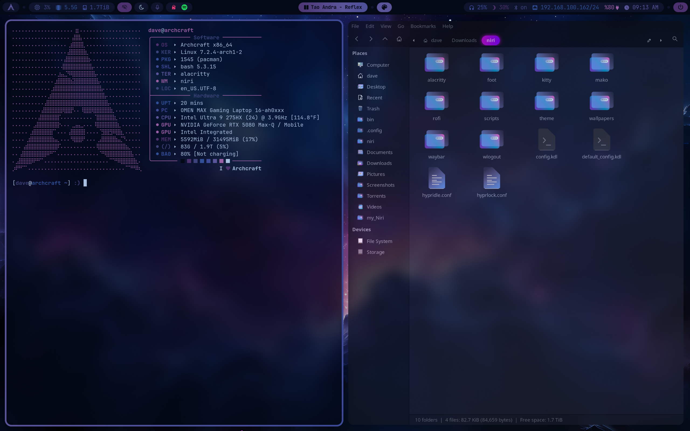

# My-Archcraft-with-Niri
My Niri dotfiles on Archcraft.

I'm using Alacritty terminal, Thunar, Geany and Firefox.

I have used i3 for a long time and then went to Omarchy with Hyprland.  Been hearing great things about Niri so I thought I would try it out.

When I was on i3 I was using Archcraft.  If you haven't seen Archcraft you should check it out as it is really nice.

Ater installing Archcraft this time, with Niri, I did have a few quirks to work out.  I used Grok and all is good.

If you want to try my dots, I suggest backing up your niri folder.

Screenshot

Wallpaper

